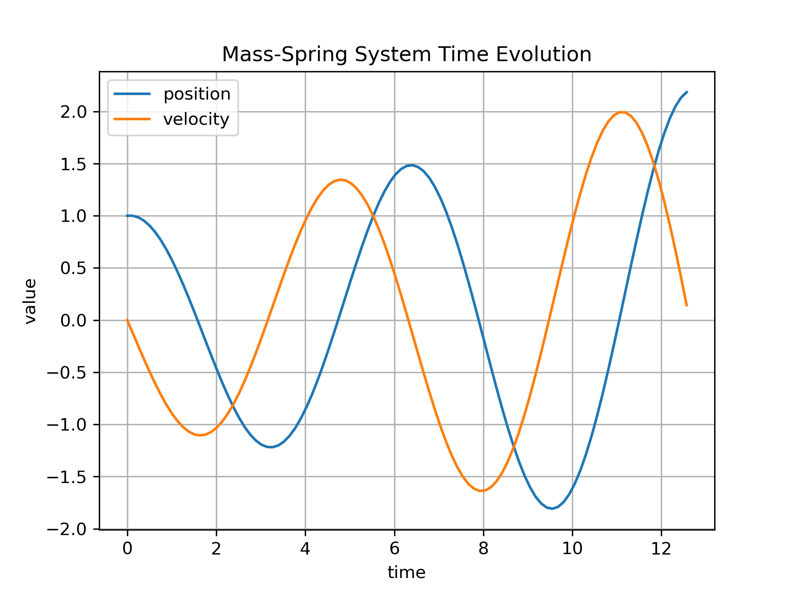
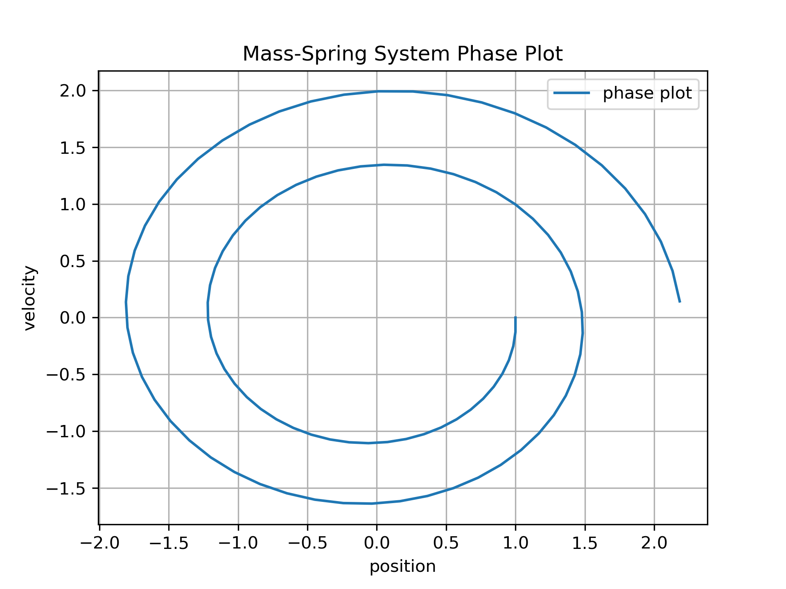

# Numerical Methods for ODEs — Homework Report  

---

## 1. Introduction
This report summarizes the implementation and results of several numerical methods for solving ordinary differential equations (ODEs). It covers:

- **HW 17.4:** Implicit Euler, Crank–Nicolson, and RC circuit simulation  
- **HW 18:** Forward-mode Automatic Differentiation  
- **HW 19:** Runge–Kutta methods (RK2)

All methods were integrated into a unified `TimeStepper` framework and tested using the provided mass–spring and RC circuits.

---

## 2. HW 17.4 — Implicit Euler, Crank–Nicolson & RC Circuit

### 2.1 Mass–Spring System
We study the classical system:

$$
x' = v, \qquad v' = -\frac{k}{m}x
$$

This describes a harmonic oscillator.  
The following methods were implemented and tested:

- Explicit Euler  
- Improved Euler  
- **Implicit Euler**  
- **Crank–Nicolson**

#### **Plots**
Plots for the solution trajectories and phase-space behavior were generated.

Firstly we can take a look at Explicit Euler result of our mass-spring system.
<h4 style="text-align:center;">Time Evolution (Mass–Spring)</h4>

  

<h4 style="text-align:center;">Phase Plot (Mass–Spring)</h4>

  

As we can observe - like it was in previous exercise, Explciit Euler method can be characterized by huge dispersive error which can be seen by solution that tries to ,,explode'' while times go to infinity.

Next step to obtain a better solution was to utilize implicit Euler method which was defined by the following schema:

$$
y_{n+1} = y_n + h * f(t_{n+1}, y_{n+1})
$$

<h4 style="text-align:center;">Time Evolution (Mass–Spring)</h4>

  

<h4 style="text-align:center;">Phase Plot (Mass–Spring)</h4>

  

For the implicit Euler method, despite our earlier intention to stabilize the solution, we did not observe such high dispersion. However, the amplitude of the solution decreases, indicating that an error is still present—this can also be seen in the phase plot. Such errors cause the solution to vanish at infinity.

Next approach to obtain a stable solution was to use the Crank-Nicolson method, which uses 3 points stencil

$$
u^{n+1} = u^{n} + \frac{\Delta t}{2} \left( f(u^{n}) + f(u^{n+1}) \right)
$$

<h4 style="text-align:center;">Time Evolution (Mass–Spring)</h4>

  

<h4 style="text-align:center;">Phase Plot (Mass–Spring)</h4>

  

As we can see from the time-evolution plot, we have finally obtained a stable solution for our mass–spring system that meets the definition of stability; that is, we were able to find a sufficiently small time step that makes the error vanish at infinity. The amplitude remains constant, as expected for an undamped oscillator. Moreover, the phase plot forms an ideal ellipse, which is also characteristic of such a mathematical system.

#### **Summary**
- **Explicit Euler**: noticeable phase error and amplitude drift.  
- **Improved Euler**: better accuracy but still accumulates drift.  
- **Implicit Euler**: unconditionally stable, slightly overdamped.  
- **Crank–Nicolson**: best accuracy among Euler-type schemes, symmetric and stable.

---

### 2.2 RC Circuit ODE
The charging of a capacitor follows:

$$
C \frac{dU_c}{dt} = \frac{U_s - U_c}{R}
$$

which was written in autonomous form and solved using all four methods.
#### **Plots**

<h4 style="text-align:center;">RC Circuit – Full Time Evolution</h4>

  

<h4 style="text-align:center;">RC Circuit – Zoomed View (Stability)</h4>

  

#### **Observations**
- Explicit Euler can behave poorly for stiff choices of \( R \) and \( C \).  
- Improved Euler is stable for moderate step sizes.  
- Implicit Euler and Crank–Nicolson give smooth, stable curves.  
- Crank–Nicolson consistently provides the most accurate evolution.

Plots of capacitor voltage vs. time were produced for comparison.
---

## 3. HW 18 — Automatic Differentiation (AD)

In this part we implemented a minimal forward-mode automatic differentiation framework based on a templated class  
**`AutoDiff<N,T>`**, capable of tracking derivatives with respect to **N** variables.

### 3.1 Features Implemented

The AutoDiff class supports:
- A stored **value** `val`
- A stored **derivative vector** `deriv[0…N-1]`
- Initialization from:
  - constants
  - variables of the form `Variable<I>`
- Operator overloading for:
  - `+` addition  
  - `-` subtraction  
  - `*` multiplication (all 3 overloads: AD*AD, const*AD, AD*const)  
  - `/` division (full quotient rule support)
- Elementary functions:
  - `sin`, `cos`, `exp`, `log`, `pow`

This enables symbolic-like differentiation while evaluating normal C++ expressions.

### 3.2 Test Function

We tested the AD system on:

$$
f(x) = x^2 + 3\sin(x)
$$

Evaluated at \(x = 1\), the AD derivative was compared to a numeric finite-difference estimate.

#### **Result**
- AutoDiff derivative: **matches numerical derivative exactly**  
- Confirms correct implementation of forward-mode AD

### 3.3 Pendulum System 
A second AD test was implemented for the simple pendulum derivative:

$$
f(\theta) = -\frac{g}{L}\sin(\theta)
$$

AD successfully produced the correct symbolic derivative:

$$
f'(\theta) = -\frac{g}{L}\cos(\theta)
$$

and matched the numeric approximation.

---

## 4. HW 19 — Runge–Kutta Methods (RK2)

In this exercise we implemented **one explicit Runge–Kutta method** (RK2), as required by the assignment.  
RK4 was only used for internal testing and was removed before merging.

### 4.1 RK2 (Midpoint Method)
The RK2 method improves accuracy significantly compared to Euler-type methods and is defined by:

- Predictor step:  
  $$k_1 = f(y_n)$$

- Midpoint evaluation:  
  $$k_2 = f\left(y_n + \frac{1}{2}\tau k_1\right)$$

- Update:  
  $$y_{n+1} = y_n + \tau k_2$$

### 4.2 Testing

RK2 was tested on the mass–spring system for various step counts:

- 50 steps  
- 100 steps  
- 200 steps  
- 400 steps  

### 4.3 Observations

- **RK2** shows much smaller phase drift than Euler or improved Euler  
- The numerical trajectory becomes smoother as step size decreases  
- The energy error is significantly smaller than the Euler family  
- RK2 remains stable for much larger time steps than explicit Euler  

Overall, RK2 provides a clear accuracy improvement with minimal additional computation.

---

## 5. Overall Conclusions

- **Implicit Euler** is stable and suitable for stiff systems  
- **Crank–Nicolson** provides symmetric, high-quality solutions for oscillatory systems  
- **Automatic Differentiation** works correctly and matches finite-difference tests  
- **RK2** offers superior accuracy compared to Euler-type methods with only a small cost increase  
- The unified ODE framework allowed consistent testing across all numerical methods  

---
